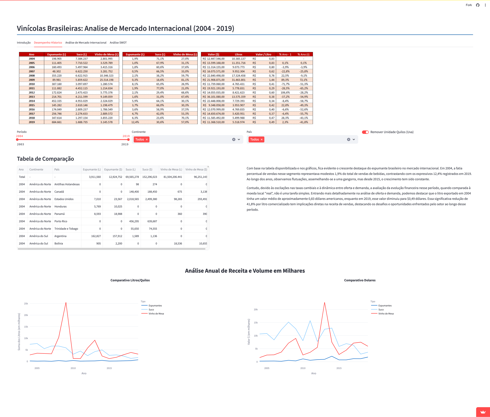
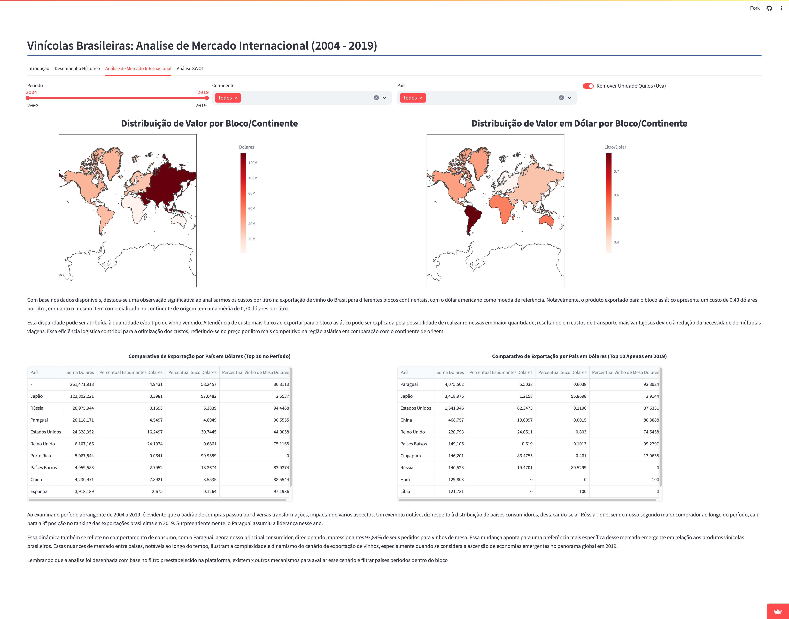
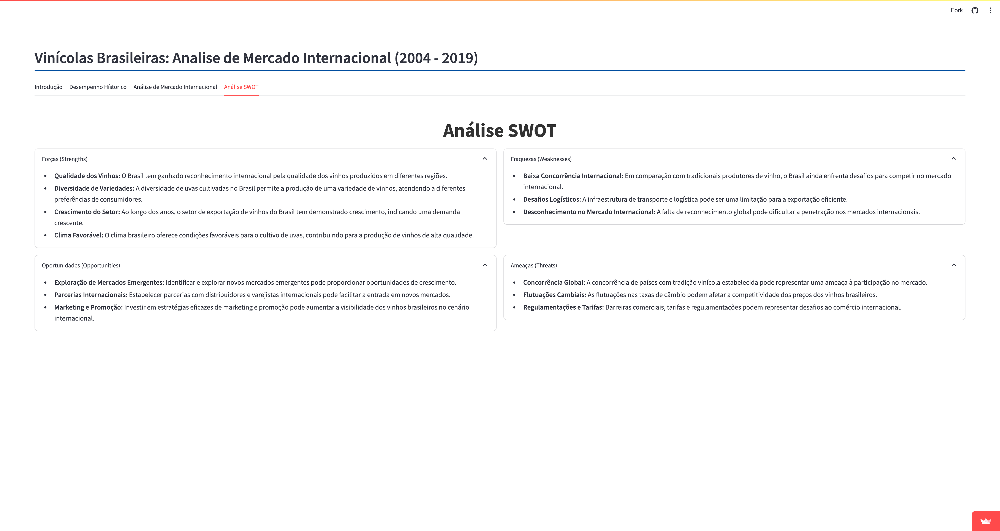

# Vinícolas Brasileiras: Análise de Exportação de Vinho e Derivados


Este projeto foi desenvolvido como parte de uma pesquisa acadêmica e é mantido por:
* Leandro Soares da Silva - RM 352511
* Marcos Barbosa da Silva - RM 352571.

Link do projeto: https://exportacao-de-vinho-e-derivados-moe5x7m9uh9nef9xcuhppb.streamlit.app/

Este repositório contém um projeto desenvolvido como parte de um curso de pós-graduação em Data Analytics pela FIAP. O objetivo do projeto é analisar o desempenho das exportações de vinho e derivados do Brasil ao longo dos anos, abordando diferentes aspectos como introdução, desempenho histórico, análise de mercado internacional aplicando conhecimentos e tecnicas adquiridas durante as aulas.

## Estrutura do Repositório

- **tabs/**: Contém os arquivos Python que definem os diferentes guias da aplicação Streamlit.
  - `__init__.py`: Arquivo de inicialização do pacote `tabs`.
  - `analise_internacional.py`: Define o guia de análise de mercado internacional.
  - `desempenho_hist.py`: Define o guia de desempenho histórico.
  - `introducao.py`: Define o guia de introdução.
  - `melhorias.py`: Define o guia de melhorias.
  - `sobre.py`: Define o guia "Sobre" (comentado no código).
  - **textos/**: Contém arquivos com textos utilizados nos guias.
    - `__init__.py`: Arquivo de inicialização do pacote `textos`.
    - `textos_analise_internacional.py`: Contém textos para o guia de análise de mercado internacional.
    - `textos_desempenho_hist.py`: Contém textos para o guia de desempenho histórico.
    - `textos_introducao.py`: Contém textos para o guia de introdução.
- `.gitignore`: Arquivo de configuração do Git para ignorar certos arquivos/diretórios.
- `README.md`: Este arquivo de documentação em Markdown.
- `app.py`: Arquivo principal da aplicação Streamlit.
- `continents.geojson`: Arquivo GeoJSON para visualizações de mapa.
- `requirements.txt`: Arquivo de requisitos do Python.

## Como Executar

Para executar a aplicação Streamlit localmente, siga estas etapas:

1. Certifique-se de ter Python instalado em seu ambiente.
2. Instale as dependências executando o seguinte comando no terminal/prompt de comando:
```bash
pip install -r requirements.txt
```
3. Execute a aplicação usando o seguinte comando:
```bash
streamlit run app.py
```

Isso iniciará a aplicação Streamlit localmente e você poderá acessá-la no seu navegador.

# Streamlit App







